# Comparative Statistical-Linguistic Study Of U.S. House Tweet Corpora

## Abstract

This project compares authored posts from official X/Twitter accounts of Republican and Democratic members of the U.S. House of Representatives. The primary strict corpus uses the fixed window from `2025-01-03T00:00:00Z` to `2026-01-03T00:00:00Z`, excludes retweets and replies, and keeps quote tweets only as the author's own text. The main strict balanced corpus contains 410 accounts and 20,479 posts. The extended corpus is used as a robustness check and contains 429 accounts and 21,450 posts.

The analysis combines corpus linguistics and statistical linguistics: UTF-8 text mirrors, L and V features, Zipf and Heaps laws, n-grams, keywords, repetition, distances, clustering, randomization control, network features, stylometry, NMF topic modeling, transparent issue dictionaries, and a global TF-IDF Logistic Regression party-classifier control. The main finding is that party affiliation is visible in aggregate text distances, topic distributions, issue marker rates, classifier recoverability, and several surface-style markers. At the same time, unsupervised clustering does not produce a clean two-cluster party split, so the party signal should be described as measurable but diffuse.

## Source And Evidence Base

| Evidence | Local or web source |
| --- | --- |
| House party counts on May 1, 2026 | https://clerk.house.gov/member_info/olm-119.pdf|
| Corpus variant counts | `../metadata/corpus_variants.csv` |
| Methodology | `../docs/methodology.md` |
| Data management and reproducibility | `../docs/data_management.md` |
| Requirement coverage | `requirements_coverage.md` |

## Research Design

Main hypothesis: if party affiliation is reflected in the texts, distances between Republican and Democratic accounts should be higher on average than distances within the same party, and clustering should partially recover the party split.

Null hypothesis: party labels are not associated with statistical text features, and the observed structure is not stronger than randomized party labels.

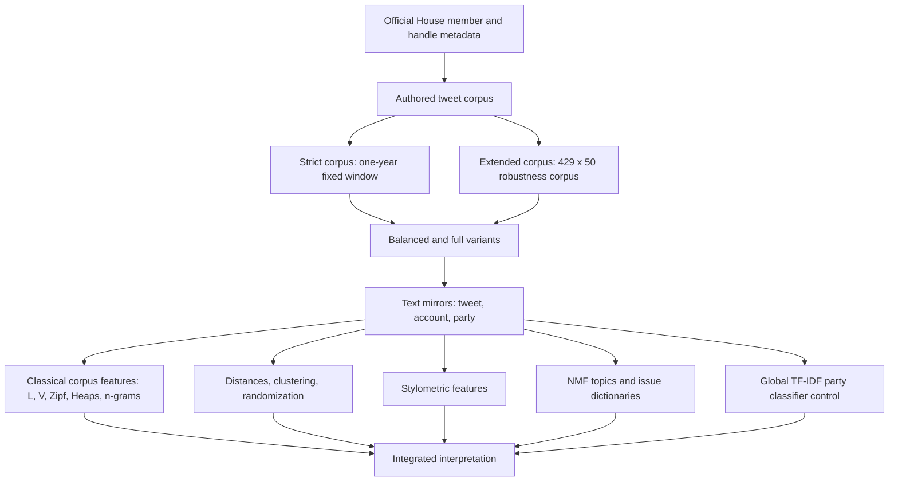

## Corpus Variants

Source: `../metadata/corpus_variants.csv`.

| Corpus | Mode | Accounts | Posts | Role |
| --- | ---: | ---: | ---: | --- |
| strict | balanced | 410 | 20,479 | Primary comparison |
| strict | full | 417 | 20,798 | First robustness check |
| extended | balanced | 424 | 21,200 | Maximized balanced robustness check |
| extended | full | 429 | 21,450 | Maximized full robustness check |

The strict balanced corpus is the primary evidence base. The extended corpus is a robustness corpus, not the main official one-year corpus, because it includes supplemental records and documented handle repairs.

## Processing Pipeline

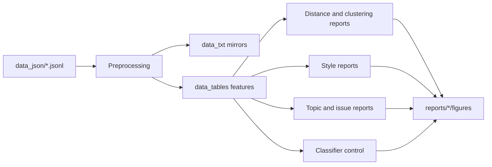

## Main Distance Result

Sources: `strict_balanced/distance_summary.csv`, `strict_full/distance_summary.csv`, `extended_balanced/distance_summary.csv`, `extended_full/distance_summary.csv`.

| Corpus mode | D-D mean cosine | R-R mean cosine | R-D mean cosine | R-D minus within mean |
| --- | ---: | ---: | ---: | ---: |
| strict balanced | 0.945970 | 0.952938 | 0.961037 | 0.011583 |
| strict full | 0.946020 | 0.953340 | 0.961204 | 0.011400 |
| extended balanced | 0.946545 | 0.952570 | 0.960838 | 0.011280 |
| extended full | 0.946604 | 0.952839 | 0.960929 | 0.011134 |

Interpretation: Republican-Democratic account pairs are farther apart on average than within-party pairs in all four corpus modes.

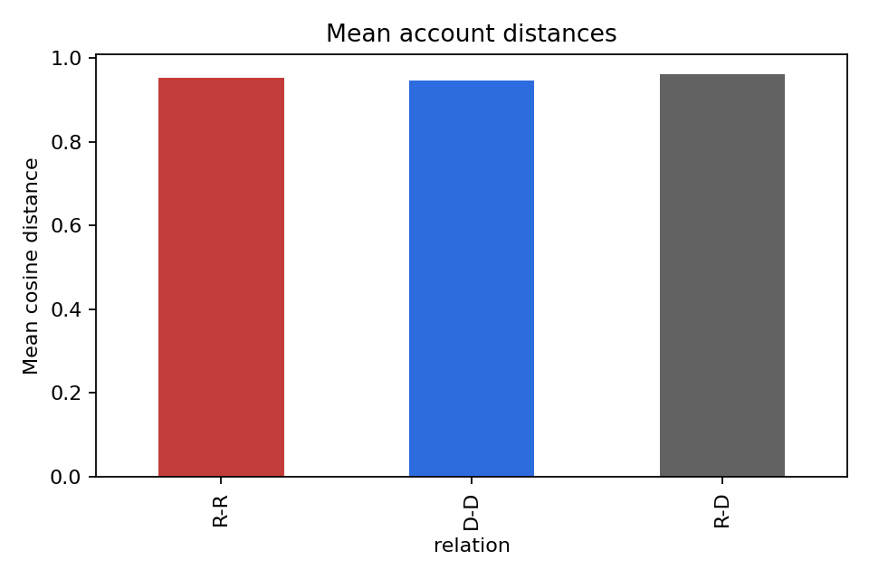

## Randomization Control

Sources: `<corpus>_<mode>/randomization_report.csv`.

| Corpus mode | Observed gap | Iterations | One-sided p-value |
| --- | ---: | ---: | ---: |
| strict balanced | 0.011583 | 1,000 | 0.000999 |
| strict full | 0.011400 | 1,000 | 0.000999 |
| extended balanced | 0.011280 | 1,000 | 0.000999 |
| extended full | 0.011134 | 1,000 | 0.000999 |

The p-value is the minimum possible value under 1,000 randomization iterations with the implemented formula. In the generated shuffled-label trials, none produced a party-distance gap as large as the observed gap.

## Clustering And 2D Map

Sources: `../data_tables/<corpus>_<mode>/clustering_by_user.csv`.

| Corpus mode | Adjusted Rand Index | Silhouette cosine |
| --- | ---: | ---: |
| strict balanced | 0.000048 | 0.025837 |
| strict full | -0.000271 | 0.025632 |
| extended balanced | 0.000045 | 0.025920 |
| extended full | -0.000171 | 0.025783 |

Interpretation: the party signal exists in aggregate distances, but unsupervised two-cluster assignment does not recover a clean Republican/Democratic partition.

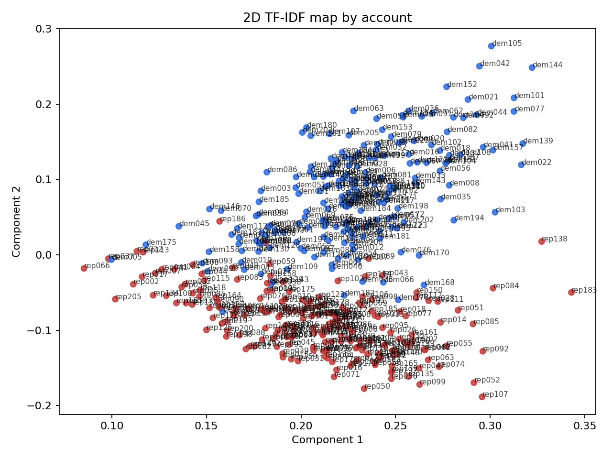

## Frequency Laws

Source: `../data_tables/strict_balanced/law_fits.csv`.

| Law | Party | Slope |
| --- | --- | ---: |
| Zipf | Republican | -1.418452 |
| Zipf | Democratic | -1.420912 |
| Heaps | Republican | 0.530078 |
| Heaps | Democratic | 0.535305 |

Interpretation: Zipf and Heaps slopes are very similar across parties. These laws describe broad corpus behavior rather than a strong party separator.

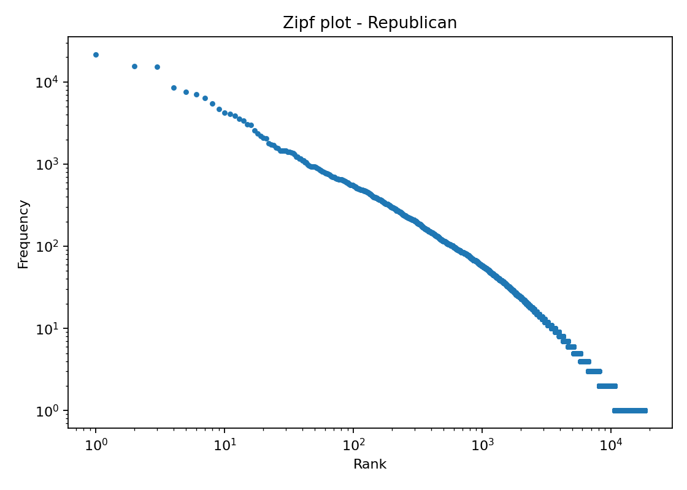

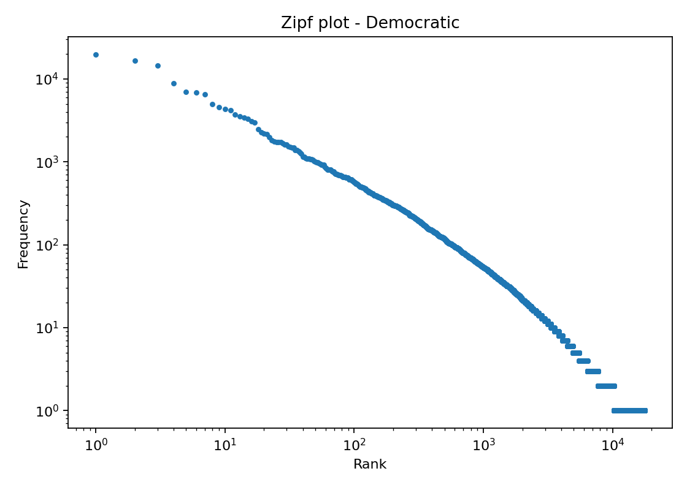

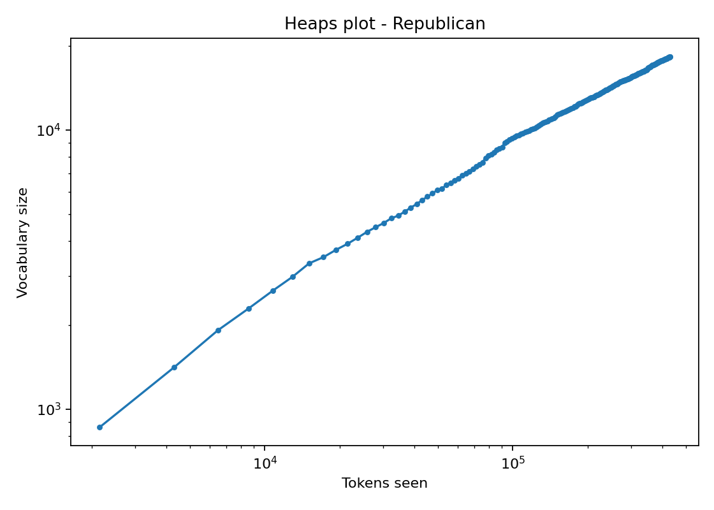

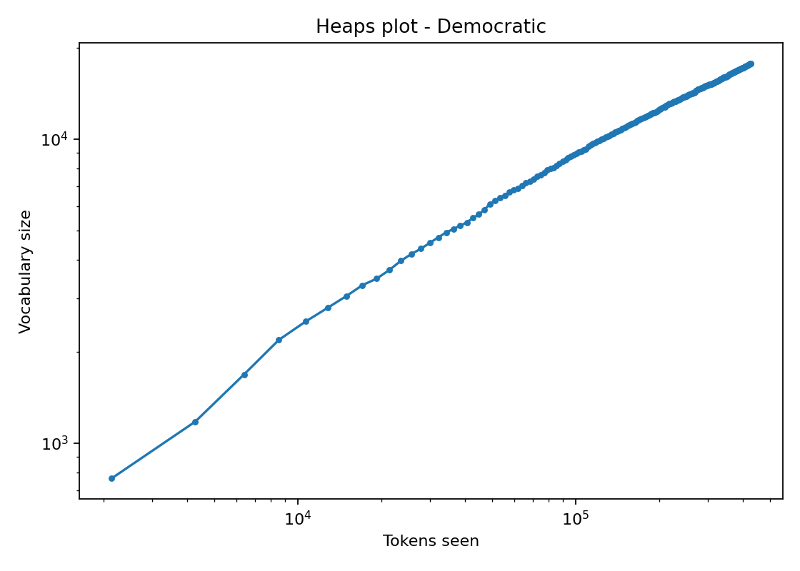

## Stylometric Results

Sources: `../data_tables/strict_balanced/style_party_effects.csv`, `strict_balanced/figures/style_party_effects.png`.

| Feature | Democratic mean | Republican mean | R minus D | p-value | Cliff's delta |
| --- | ---: | ---: | ---: | ---: | ---: |
| positive lexicon per 100 words | 1.248369 | 2.034440 | 0.786071 | 1.89e-27 | 0.619798 |
| mention per 100 words | 0.641341 | 1.401481 | 0.760140 | 3.26e-18 | 0.496871 |
| lexicon sentiment balance | 0.882354 | 1.557137 | 0.674783 | 2.87e-17 | 0.482594 |
| emoji count | 0.115236 | 0.329561 | 0.214325 | 1.28e-16 | 0.470054 |
| modal per 100 words | 1.418671 | 1.120054 | -0.298618 | 1.44e-16 | -0.471695 |
| emoji per 100 words | 0.505239 | 1.494787 | 0.989548 | 3.68e-15 | 0.447020 |
| uppercase character share | 0.065395 | 0.079725 | 0.014331 | 5.99e-13 | 0.411160 |
| negation per 100 words | 0.794399 | 0.555946 | -0.238453 | 3.83e-12 | -0.396454 |

Interpretation: Republican accounts have higher rates for positive marker-list words, mentions, emojis, uppercase share, and exclamation marks. Democratic accounts have higher rates for modal markers and negation markers. These are stylometric markers, not full psychological or sentiment classification.

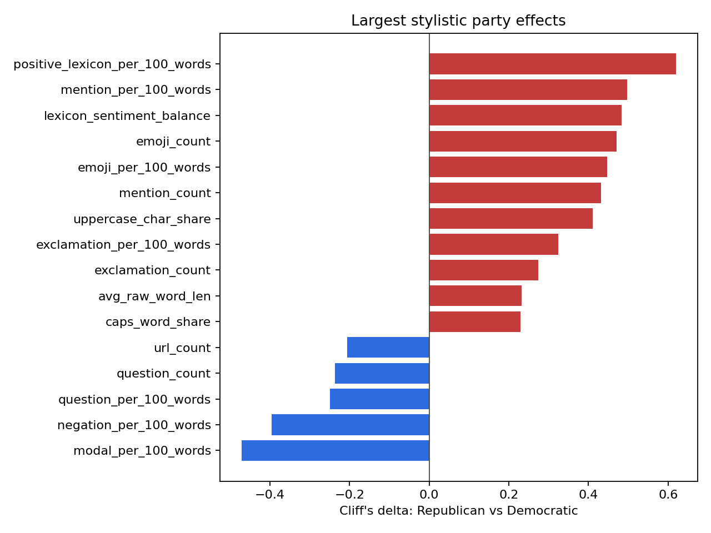

## NMF Topic Modeling

Sources: `../data_tables/strict_balanced/topic_model_terms.csv`, `../data_tables/strict_balanced/topic_party_effects.csv`.

| Topic | Democratic mean | Republican mean | R minus D | p-value |
| --- | ---: | ---: | ---: | ---: |
| tax / credits / tax credits / aca / aca tax | 0.068376 | 0.032612 | -0.035764 | 1.16e-28 |
| care / health / health care / costs / americans | 0.083369 | 0.041072 | -0.042297 | 3.93e-26 |
| mention / mention mention / mention url / thank mention / thank | 0.059354 | 0.117722 | 0.058368 | 2.18e-21 |
| happy / thanksgiving / hanukkah / happy thanksgiving / loved | 0.091693 | 0.060926 | -0.030767 | 3.20e-20 |
| day / veterans / service / nation / honor | 0.083275 | 0.124527 | 0.041252 | 6.88e-20 |
| files / epstein / release / epstein files / release epstein | 0.047785 | 0.024620 | -0.023165 | 5.33e-18 |
| government / shutdown / democrats / government shutdown / people | 0.063900 | 0.106653 | 0.042753 | 2.35e-11 |

Interpretation: Democratic-leaning NMF components involve ACA tax credits, health care, holiday/community language, and Epstein-files language. Republican-leaning components involve mention-heavy posts, veterans/service language, and shutdown/government language. These are unsupervised components, not manually validated issue labels.

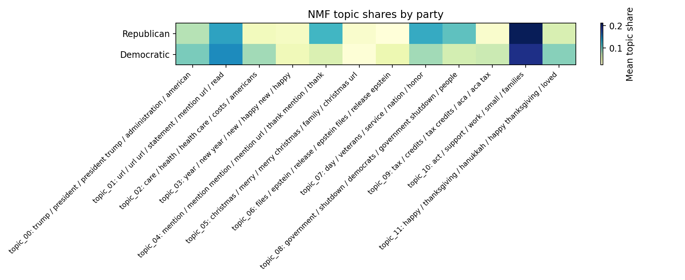

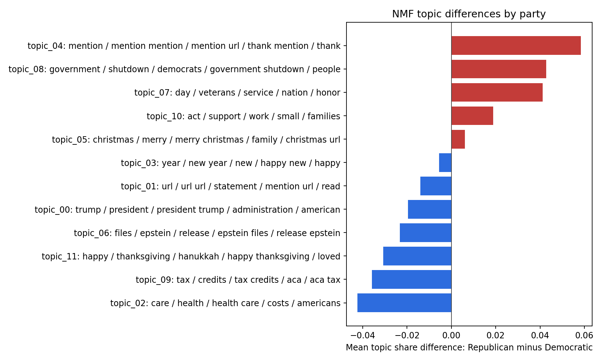

## Issue Dictionaries

Sources: `../data_tables/strict_balanced/issue_dictionaries.csv`, `../data_tables/strict_balanced/issue_party_effects.csv`.

| Issue rate | Democratic mean | Republican mean | R minus D | p-value |
| --- | ---: | ---: | ---: | ---: |
| health care | 10.860444 | 4.925976 | -5.934468 | 5.97e-28 |
| military veterans | 2.733998 | 4.155235 | 1.421237 | 2.49e-07 |
| education | 2.754499 | 1.974293 | -0.780206 | 2.25e-05 |
| immigration border | 1.733466 | 3.022052 | 1.288586 | 2.39e-04 |
| economy taxes | 10.779169 | 9.151933 | -1.627236 | 2.65e-04 |
| government shutdown | 1.563140 | 3.268341 | 1.705201 | 3.33e-04 |
| energy climate | 1.511499 | 2.308667 | 0.797167 | 9.23e-04 |
| Trump/Biden | 7.009489 | 5.676200 | -1.333290 | 3.10e-03 |

Interpretation: Democratic accounts show higher health care, education, economy/taxes, and Trump/Biden marker rates. Republican accounts show higher military/veterans, immigration/border, government shutdown, and energy/climate marker rates. These are transparent marker counts per 1,000 words, not full semantic annotation.

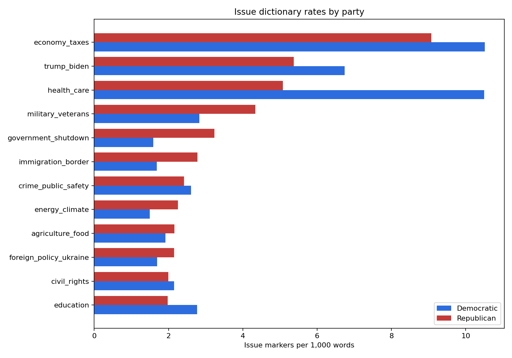

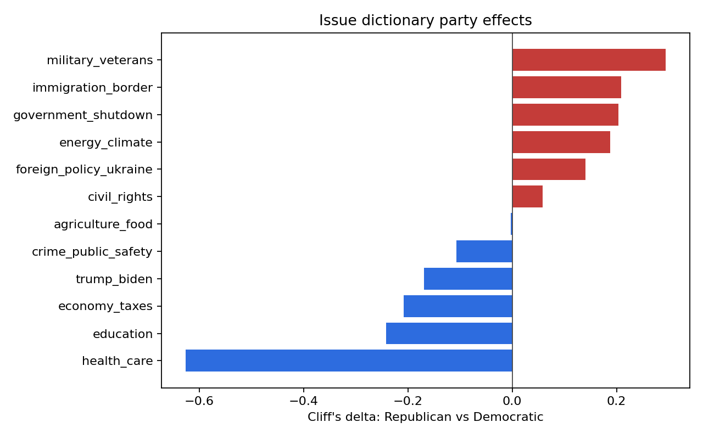

## Global Party Classifier Control

Sources: `../data_tables/<corpus>_<mode>/party_classifier_summary.csv`, `../data_tables/strict_balanced/party_classifier_confusion_matrix.csv`, `../data_tables/strict_balanced/party_classifier_top_features.csv`.

This classifier is global, not topic-only. It uses full account-level TF-IDF text features and Logistic Regression. It is used as a control test, not as the main explanatory method.

| Corpus mode | Accounts | Accuracy | Balanced accuracy | Macro F1 |
| --- | ---: | ---: | ---: | ---: |
| strict balanced | 410 | 0.980488 | 0.980488 | 0.980486 |
| strict full | 417 | 0.980815 | 0.980649 | 0.980802 |
| extended balanced | 424 | 0.978774 | 0.978774 | 0.978771 |
| extended full | 429 | 0.981352 | 0.981241 | 0.981344 |

For strict balanced, the confusion matrix contains 199 correctly predicted Democratic accounts, 203 correctly predicted Republican accounts, 6 Democratic accounts predicted as Republican, and 2 Republican accounts predicted as Democratic.

Interpretation: party labels are highly recoverable from full account-level text. This supports the presence of party signal, while the weak clustering result shows that the signal is not a simple unsupervised two-cluster geometry.

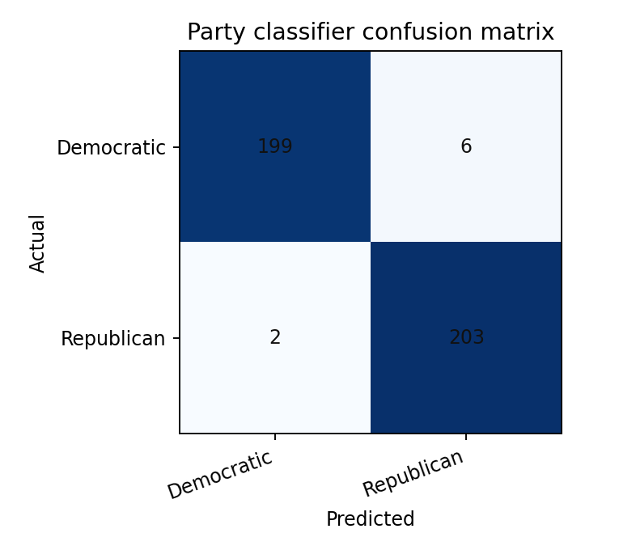

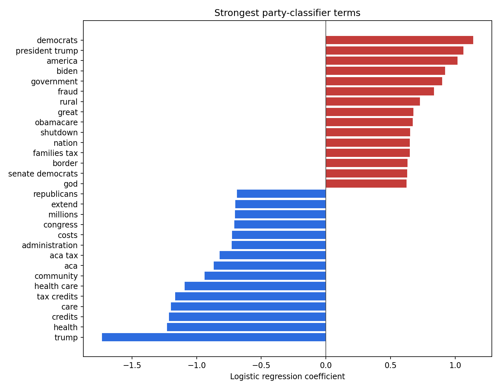

## Synthesis

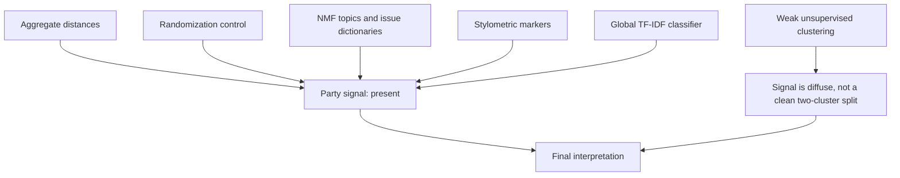

The null hypothesis is weakened by multiple independent outputs: distance gaps, randomization control, topic and issue differences, stylometric markers, and classifier recoverability. However, the clustering results prevent a stronger claim that the two parties form cleanly separated textual groups.

## Final Conclusion

In the collected House tweet corpora, party affiliation is reflected in aggregate statistical-linguistic distance patterns, thematic distributions, issue-marker rates, classifier recoverability, and several stylometric markers. The effect is stable across the strict primary corpus and the extended robustness corpus, but it is diffuse and coexists with substantial within-party variation.

## Main Limitations

1. SocialData API was used instead of direct X API v2 because of access and budget constraints. Raw API outputs are preserved for audit.
2. The strict corpus does not contain exactly 50 posts for every account. It uses eligibility filtering and balanced subsets.
3. The extended corpus reaches 50 posts for every voting member, but includes supplemental records and documented handle repairs.
4. Retweets and replies are excluded from the authored-only corpus.
5. NMF topics are unsupervised components and should not be treated as manually validated issue labels.
6. Issue dictionaries are transparent marker lists, but they do not capture all context or all meanings of an issue.
7. The classifier is a control test, not the main explanatory method.

## Reproducibility

For existing data:

```powershell
.\.venv\Scripts\python.exe -m house_tweet_linguistics mirrors --corpus strict --balanced
.\.venv\Scripts\python.exe -m house_tweet_linguistics mirrors --corpus strict --full
.\.venv\Scripts\python.exe -m house_tweet_linguistics mirrors --corpus extended --balanced
.\.venv\Scripts\python.exe -m house_tweet_linguistics mirrors --corpus extended --full

.\.venv\Scripts\python.exe -m house_tweet_linguistics analyze --corpus strict --balanced
.\.venv\Scripts\python.exe -m house_tweet_linguistics analyze --corpus strict --full
.\.venv\Scripts\python.exe -m house_tweet_linguistics analyze --corpus extended --balanced
.\.venv\Scripts\python.exe -m house_tweet_linguistics analyze --corpus extended --full
```
